## Advanced Lane Lines Finding Writeup
---

**Advanced Lane Finding Project**

The goals / steps of this project are the following:

* Compute the camera calibration matrix and distortion coefficients given a set of chessboard images.
* Apply a distortion correction to raw images.
* Use color transforms, gradients, etc., to create a thresholded binary image.
* Apply a perspective transform to rectify binary image ("birds-eye view").
* Detect lane pixels and fit to find the lane boundary.
* Determine the curvature of the lane and vehicle position with respect to center.
* Warp the detected lane boundaries back onto the original image.
* Output visual display of the lane boundaries and numerical estimation of lane curvature and vehicle position.

---

### Contents in the Jupyter Notebook, 'pipeline.ipynb'
 I have implemented all of visulizations and pipeline functions in the
jupyter notebook file, 'pipeline.ipynb' which is enclosed in my submission.
 In the notebook, I break down my steps as following:

    0. Import Packages
    1. Camera Calibration
     1.1. Read chessboard images
     1.2. Calibrate Camera
    2. Apply distortion correction to raw images
    3. Perspective Transform
    4. Thresholded binary image
     4.1. Visualize Color Transforms
     4.2. Color thresholding
      4.2.1. Effect of histogram equalization
     4.3. Applying Sobel Operator
     4.4. Combine thresholding techniques
    5. Finding Lane Linee
     5.1. Histogram
     5.2. Fit Lanes with Silding Window Method
     5.3. Radius of curvature and lateral offset of camera
    6. Pipeline

 I will describe my works in the following, with the chapter numbers above.

---

### Camera Calibration

#### 1. Briefly state how you computed the camera matrix and distortion coefficients. Provide an example of a distortion corrected calibration image.

The code for this step is contained in the section '1. Camera Calibration' of the IPython notebook located in "./pipeline.ipynb" 

I start by displaying chessboard images to see how much they distorted in the section '1.1. Read chessboard images'. There have ben 20 images with 9x6 grid chessboard cells. 

In the '1.2. Calibrate Camera', as learned in the lessons, I have started to find corners from the images, and visualized them. And using corner informations, I have defined 'object points' and 'image points' to calculate camera matrix. With the 'cv2.calibrateCamera()' function, I've aquired the camera matrix 'mtx' and distortion coefficients 'dist'. 

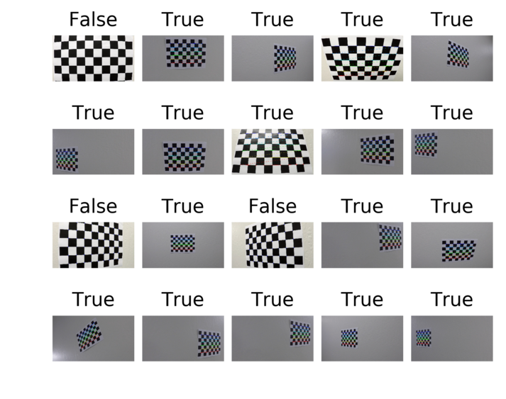

In the '2. Apply distortion correction to raw images', I've defined 'undistort_img()' function, to undistort images with regard to 'mtx' and 'dist' values, using 'cv2.undistort()'. 

    def undistort_img(img, mtx=mtx, dist=dist, display=False):
        undist = cv2.undistort(img, mtx, dist, None, mtx)
        .......
        return undist

Here are examples of undistorted images and their originals : 

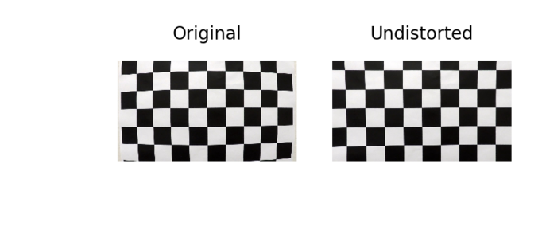

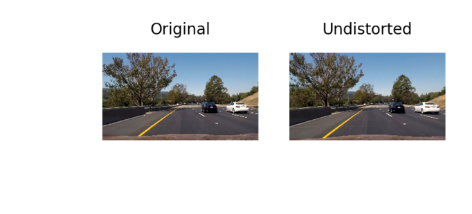

### Pipeline (single images)

#### 1. Provide an example of a distortion-corrected image.

 This is already described in the above. And, there are all of the undistorted
images in the section '2. Apply distortion correction to raw images' of 'pipeline.ipynb'.

#### 2. Describe how (and identify where in your code) you performed a perspective transform and provide an example of a transformed image.

 I have applied 'Perspective Transform' before 'Color Transform' to focus on
the exact area to find out lanes, afterwards. 
 
 In the section '3. Perspective Transform', I have set the region of interest
area like below: 

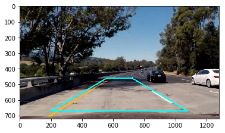

Then, I have calculated transform matrix 'M' using 'cv2.getPerspectiveTransform()', and its inverse 'Minv', too.

    M = cv2.getPerspectiveTransform(src, dst)
    Minv = cv2.getPerspectiveTransform(dst, src)

After that, I have defined 'warp_img()' function to ward an image according to 'M' (or Minv) and visualized the examples :

    def warp_img(img, M=M, display=False):
        img_size = img.shape[1::-1]
        warped = cv2.warpPerspective(img, M, img_size, flags=cv2.INTER_LINEAR)
        ......    
        return warped

The warped image of the above 'roi example':

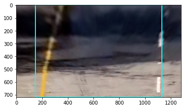

And, another examples:

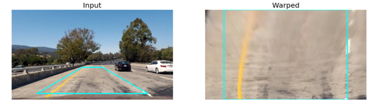

There are all warped images in the '3. Perspective Transform' of the pipeline.ipynb. 

#### 3. Describe how (and identify where in your code) you used color transforms, gradients or other methods to create a thresholded binary image.  Provide an example of a binary image result.

 I used a combination of color and gradient thresholds to generate a binary
image. Each step is decribed in the followin, and, one more technique I have applied which is not introduced in the lesson, is 'Histogram Equalization', this will be also explained below.  

##### 3.1. Color Transform and Thresholding
 I have considered gray images and 3 types of color images to find out
effective thresholding. In the section '4.1. Visualize Color Transforms', I have visualized all of color spaces which I have considered, RGB, HLS and LAB are them. 

The original image is shown : 

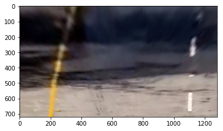

And, each channels are visualized to examine which are better for seperating lanes from their backgrounds : 

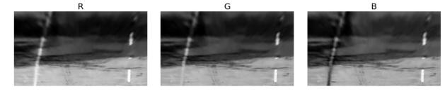

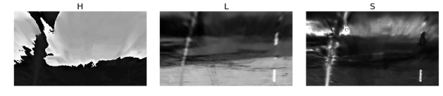

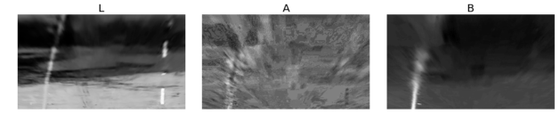

According to their display, I have chosen three chanels to use seperate lanes :
. 'R' in the RGB :  Relatively sensitive to both yellow and white lanes
. 'L' in the LAB :  Relatively sensitive to white
. 'B' in the LAB :  Relatively sensitive to yellow

 Then, in the next section '4.2. Color thresholding', I have applied color
value threshold to channels (R, L, B) as learned in the lesson. 

 In the section '4.2. Color Thresholding',  I've defined the
'color_thresholding()' function which returns a combined binary image  thresholded by each R, L, B channel. 

    def color_thresholding(rgb_img, thres_r=(200, 250), thres_b=(180,255), thres_l=(220, 255), display=False):
          
        r = rgb_img[:,:,0]
        lab_img = cv2.cvtColor(rgb_img, cv2.COLOR_RGB2LAB)
        l = lab_img[:,:,0]
        b = lab_img[:,:,2]
        
        #####
        # Adaptive Histogram Equalization for 'R' channel
        # More explanation is on '4.2.1 Effect of Histogram Equalization'
        clahe = cv2.createCLAHE(clipLimit=2.0, tileGridSize=(8,8))
        r = clahe.apply(r)
         
        
        r_binary = np.zeros_like(r)
        r_binary[(r > thres_r[0]) & (r <= thres_r[1])] = 1
        l_binary = np.zeros_like(l)
        l_binary[(l > thres_l[0]) & (l <= thres_l[1])] = 1
        b_binary = np.zeros_like(b)
        b_binary[(b > thres_b[0]) & (b <= thres_b[1])] = 1
        ......
        combined=np.zeros_like(r_binary)
        combined[(r_binary==1)|(l_binary==1)|(b_binary==1)]=1
        ......
        return combined

 Here are two examples of 'Input, R-L-B , and combined' images in turn : 

( There are more examples in the section '4.2. Color Thresholding' of 'pipeline.ipynb' )

Test Image #1

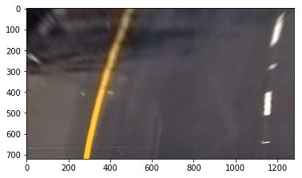

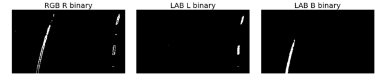

Combined binary output of test image #1

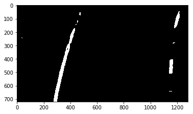

Test Image #2

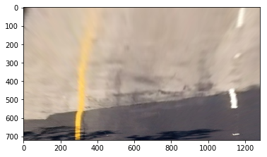

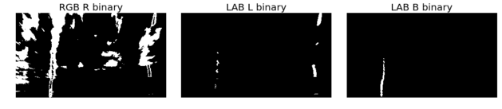

Combined binary output of test image #2

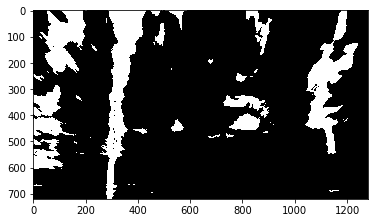
 

##### 3.1.1 Histogram Equalization

 In the function 'color_thresholding()', I've applied 'Histogram Equalization 
technique to 'R' channel of RGB  to make the thresholded result robust in birghtness. 

Histogram Equalization Function is : 
    def h_equalization(img):
        # Adaptive Histogram Equalization
        clahe = cv2.createCLAHE(clipLimit=2.0, tileGridSize=(8,8))
        img = clahe.apply(img)
        return img

 The reason why I have considered histogram equalization is that , as the 
second example above, the 'R' channel has been very sensitive to brightness and I've had difficuty to find appropriate threshold value for all test images. By adjusting equalization, I have aquired better results like below example: 
 

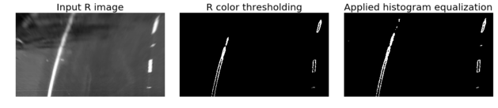

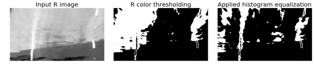

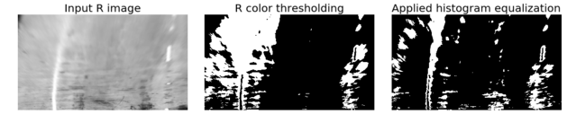

##### 3.2. Gradient Thesholding using Sobel Operator

 For gradient thresholding, I have used sobel operator filtering as learned in
the lesson. I have tried and visualized 'absolute for x direction' , 'magnitude for x and y directions' and 'gradient' thresholding in section '4.3. Applying Sobel operator'. 
 I have applied all sobel filtering methods to 'gray', 'R' and 'S' channels, 
and combined their results. 

Here are the results for each methods:

Absolute value of x direction thresholding 

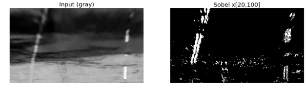

Magnitude thresholding

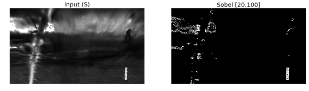

Gradient thresholding

More examples are in the section '4.3. Applying Sobel operator' of 'pipeline.ipynb'

##### 3.3. Combine

 I have defined the combination fuction 'combined_thresholding()' where I have
combined all thresholding methods including Sobel operator and Color transform. I've found the combination technique by heuristic manner testing and visualizing more and more. Probably, we can find better combination, however, I've stoppend in reasonable results. In the future, maybe, I can apply hitogram equalization to the 'B' channel of LAB, further, I may take different threshold values and combinations. Here are my combinations and results : 

    def combined_thresholding(img, display=False):
        combined_color = color_thresholding(img)
        sbinary_x_abs_gray = sobel_abs_thresh(img, format='gray', orient='x')
        sbinary_x_abs_R = sobel_abs_thresh(img, format='R', orient='x')
        sbinary_x_abs_S = sobel_abs_thresh(img, format='S', orient='x')
        sbinary_mag_gray = sobel_mag_thresh(img, format='gray')
        sbinary_mag_R = sobel_mag_thresh(img, format='R')
        sbinary_mag_S = sobel_mag_thresh(img, format='S')
        sbinary_grad_gray = sobel_grad_thresh(img, format='gray')
        sbinary_grad_R = sobel_grad_thresh(img, format='R')
        sbinary_grad_S = sobel_grad_thresh(img, format='S')
        combined_sobel = np.zeros_like(sbinary_x_abs_gray)

        combined_sobel[(((sbinary_x_abs_gray==1)|(sbinary_x_abs_R==1))\
                        | ((sbinary_mag_R==1)|(sbinary_mag_S==1)) )\
                       & ((sbinary_grad_R==1)|(sbinary_grad_R==1)) \
                        ]=1
        
        combined = combined_color | combined_sobel
        ......
        return combined

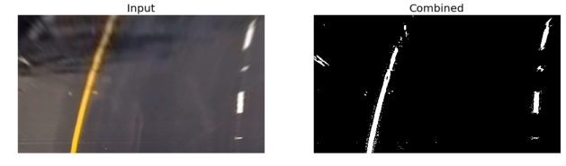

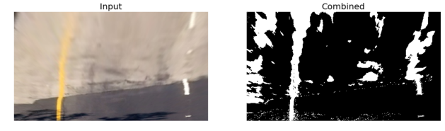

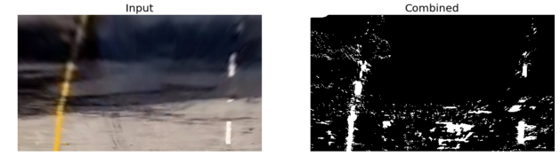

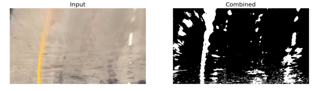

#### 4. Describe how (and identify where in your code) you identified lane-line pixels and fit their positions with a polynomial?

In the section '5. Finding lane lines' , I've applied sliding window method as learned in the lesson, and, tuned margin and minpx values a bit.  

First of all, I've calculated histogram and find appropriate starting position to search. Different from the lesson, I have calculated the histogram not from the exact half, but 100 more pixels more including the half. This is because I have found an image where the lane start position is not exactly detected due to noise. 
Here is the visualization of histogram example :

Input Image

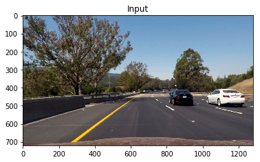

Thresholded Binary Image

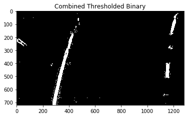

Histogram of Thresholded Binary Image

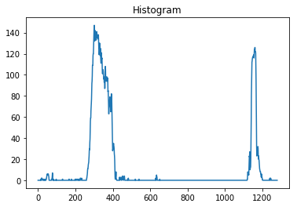

Then, I have defined the function 'fit_poly_sliding_window()' which is borrowed form the lesson, only difference is margin(100) and minpx(50).

    def fit_poly_sliding_window(binary_warped, display=False):

        histogram = np.sum(binary_warped[(binary_warped.shape[0]//2) - 100:,:], axis=0)

        # Create an output image to draw on and  visualize the result
        out_img = np.dstack((binary_warped, binary_warped, binary_warped))*255
        # Find the peak of the left and right halves of the histogram
        # These will be the starting point for the left and right lines
        midpoint = np.int(histogram.shape[0]/2)
        leftx_base = np.argmax(histogram[:midpoint])
        rightx_base = np.argmax(histogram[midpoint:]) + midpoint

        # Choose the number of sliding windows
        nwindows = 9
        # Set height of windows
        window_height = np.int(binary_warped.shape[0]/nwindows)
        # Identify the x and y positions of all nonzero pixels in the image
        nonzero = binary_warped.nonzero()
        nonzeroy = np.array(nonzero[0])
        nonzerox = np.array(nonzero[1])
        # Current positions to be updated for each window
        leftx_current = leftx_base
        rightx_current = rightx_base
        # Set the width of the windows +/- margin
        margin = 100
        # Set minimum number of pixels found to recenter window
        minpix = 50
        # Create empty lists to receive left and right lane pixel indices
        left_lane_inds = []
        right_lane_inds = []

        # Step through the windows one by one
        for window in range(nwindows):
            # Identify window boundaries in x and y (and right and left)
            win_y_low = binary_warped.shape[0] - (window+1)*window_height
            win_y_high = binary_warped.shape[0] - window*window_height
            win_xleft_low = leftx_current - margin
            win_xleft_high = leftx_current + margin
            win_xright_low = rightx_current - margin
            win_xright_high = rightx_current + margin
            # Draw the windows on the visualization image
            cv2.rectangle(out_img,(win_xleft_low,win_y_low),(win_xleft_high,win_y_high),
            (0,255,0), 2) 
            cv2.rectangle(out_img,(win_xright_low,win_y_low),(win_xright_high,win_y_high),
            (0,255,0), 2) 
            # Identify the nonzero pixels in x and y within the window
            good_left_inds = ((nonzeroy >= win_y_low) & (nonzeroy < win_y_high) & 
            (nonzerox >= win_xleft_low) &  (nonzerox < win_xleft_high)).nonzero()[0]
            good_right_inds = ((nonzeroy >= win_y_low) & (nonzeroy < win_y_high) & 
            (nonzerox >= win_xright_low) &  (nonzerox < win_xright_high)).nonzero()[0]
            # Append these indices to the lists
            left_lane_inds.append(good_left_inds)
            right_lane_inds.append(good_right_inds)
            # If you found > minpix pixels, recenter next window on their mean position
            if len(good_left_inds) > minpix:
                leftx_current = np.int(np.mean(nonzerox[good_left_inds]))
            if len(good_right_inds) > minpix:        
                rightx_current = np.int(np.mean(nonzerox[good_right_inds]))

        # Concatenate the arrays of indices
        left_lane_inds = np.concatenate(left_lane_inds)
        right_lane_inds = np.concatenate(right_lane_inds)

        # Extract left and right line pixel positions
        leftx = nonzerox[left_lane_inds]
        lefty = nonzeroy[left_lane_inds] 
        rightx = nonzerox[right_lane_inds]
        righty = nonzeroy[right_lane_inds] 

      
        # Fit a second order polynomial to each
        left_fit = np.polyfit(lefty, leftx, 2)
        right_fit = np.polyfit(righty, rightx, 2)
        
        # Generate x and y values for plotting
        ploty = np.linspace(0, binary_warped.shape[0]-1, binary_warped.shape[0] )
        left_fitx = left_fit[0]*ploty**2 + left_fit[1]*ploty + left_fit[2]
        right_fitx = right_fit[0]*ploty**2 + right_fit[1]*ploty + right_fit[2]
        
        return left_fitx, right_fitx, ploty, left_fit, right_fit, leftx_base, rightx_base

The results are as below:

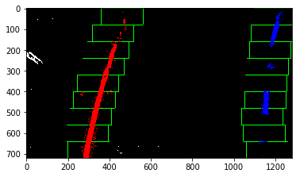

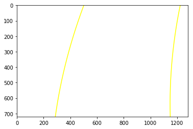

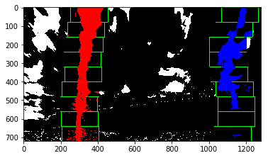

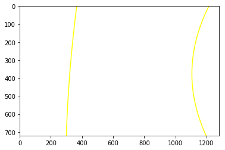

#### 5. Describe how (and identify where in your code) you calculated the radius of curvature of the lane and the position of the vehicle with respect to center.

In the section '5.3. Radius of Curverture and lateral offset of camera', I have calculated the radius of curvature and lateral offset of camera position. 
For calculating radius of curvature, I have used the equation learned in the lesson :

    # Define conversions in x and y from pixels space to meters
    ym_per_pix = 30/720 # meters per pixel in y dimension
    xm_per_pix = 3.7/700 # meters per pixel in x dimension

    def radius_of_curverture(left_fitx, right_fitx, ploty, left_fit, right_fit, display=False):

        y_eval = np.max(ploty)
        # Fit new polynomials to x,y in world space
        left_fit_cr = np.polyfit(ploty*ym_per_pix, left_fitx*xm_per_pix, 2)
        right_fit_cr = np.polyfit(ploty*ym_per_pix, right_fitx*xm_per_pix, 2)
        # Calculate the new radii of curvature
        left_curverad = ((1 + (2*left_fit_cr[0]*y_eval*ym_per_pix + left_fit_cr[1])**2)**1.5) / np.absolute(2*left_fit_cr[0])
        right_curverad = ((1 + (2*right_fit_cr[0]*y_eval*ym_per_pix + right_fit_cr[1])**2)**1.5) / np.absolute(2*right_fit_cr[0])
        
        if display==True:
            print(left_curverad, 'm', right_curverad, 'm')
            
        return left_curverad, right_curverad
      
  
And for the camera offset, I have simply used the two lane base position, and set the mean of two  as center, then, compared to the pysical center position (639.5).

    def lateral_offset(leftx_base, rightx_base, display=False):
        #print(leftx_base, rightx_base)
        center = (leftx_base+rightx_base)/2.
        offset = (center-639.5)*xm_per_pix
        if display==True:
            print(offset)
        return offset

#### 6. Provide an example image of your result plotted back down onto the road such that the lane area is identified clearly.

In the section '6. Pipeline', I have implemented this step in the function 'pipeline()'. The step consists of :

undistort_img() --> warp_img() --> combined_thresholding() --> fit_poly_sliding_window() --> radius_of_curverture() --> lateral_offset()

All are introdueced above. 

    #####
    # my pipeline 
    # preprocessing : Undistort(Calibration) -->  Warping (includes RoI) --> Combined Thresholding
    # histogram
    def pipeline(img, display=False):
        # Undistort (Camera Calibration)
        undist = undistort_img(img)
        # Perspective Transform 
        warped = warp_img(undist)
        # Combined thresholded binar
        binary_warped = combined_thresholding(warped).astype(np.int32)
        # Fit lanes with sliding window mechanism
        left_fitx, right_fitx, ploty, left_fit, right_fit, leftx_base, rightx_base \
            = fit_poly_sliding_window(binary_warped)
        
        # Radius of curverture
        left_radius, right_radius = radius_of_curverture(left_fitx, right_fitx, ploty, left_fit, right_fit)
        radius_str = "radius: %.1f m"%((right_radius+left_radius)/2)
        
        # Lateral offset of cammea from center
        x_offset = lateral_offset(leftx_base, rightx_base, display==True)
        offset_str="Camera Offset : %.3f m in the "%x_offset
        if x_offset>=0:
            offset_str+="right"
        else:
            offset_str+="left"
        
        # zero image (gray)
        warp_zero = np.zeros_like(binary_warped).astype(np.uint8)
        # zero image (color)
        color_warp = np.dstack((warp_zero, warp_zero, warp_zero))
        
        # points of lanes
        pts_left = np.array([np.transpose(np.vstack([left_fitx, ploty]))])
        pts_right = np.array([np.flipud(np.transpose(np.vstack([right_fitx, ploty])))])
        pts = np.hstack((pts_left, pts_right)).astype(np.int32)
        
        # fill inside the points of lanes
        cv2.fillPoly(color_warp, [pts], color=(0,255,0)) 
        
        # Dewarping with inverse warp matrix, "Minv"
        dewarped = warp_img(color_warp, Minv, binary_warped.shape) 
        
        # Overlay dewarped lane image on to udistorted original input
        out_img = cv2.addWeighted(undist, 1, dewarped, 0.3, 0)
        
        
        font = cv2.FONT_HERSHEY_SIMPLEX
        cv2.putText(out_img, radius_str,(10,40), font, 1,(255,0,255),2,cv2.LINE_AA)
        #cv2.putText(out_img,"left_radius : %.1f m"%left_radius,(10,80), font, 1,(255,0,255),2,cv2.LINE_AA)
        cv2.putText(out_img, offset_str,(10,80), font, 1,(255,0,255),2,cv2.LINE_AA)
            
        if display==True:
            out_warped = cv2.addWeighted(warped, 1, color_warp, 0.3, 0)
            plt.imshow(out_img)
            plt.show()
            plt.imshow(out_warped)
            plt.show()
        
        return out_img

And, here are pipelined examples including warped ones, for test images:

( More examples are in the section '6. Pipeline' of 'pipeline.ipynb' )

Image #1 

Warped

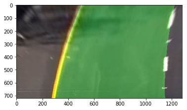

Image #2 

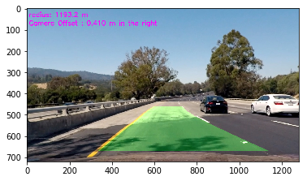

Warped

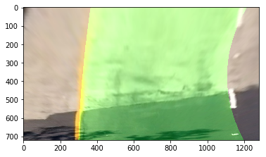

Image #3

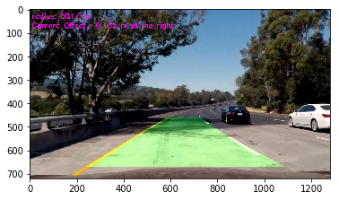

Warped

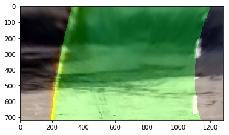

---

### Pipeline (video)

#### 1. Provide a link to your final video output.  Your pipeline should perform reasonably well on the entire project video (wobbly lines are ok but no catastrophic failures that would cause the car to drive off the road!).

Here's a [link to my video result](./output_images/output_video.mp4)

---

### Discussion

#### 1. Briefly discuss any problems / issues you faced in your implementation of this project.  Where will your pipeline likely fail?  What could you do to make it more robust?

As I test my pipeline, the method is very sensitive to brightness of background and lanes. Even though I have applied histogram equalization to 'R' channel, I think that the pipeline needed more consideration for various conditions. 

Besides brightness, I think my pipeline works good only at yellow and white lanes. In different nations, there could be different color of lanes, like blue. To overcome this, I need to consider more complicated combination of color transform and their threshold.